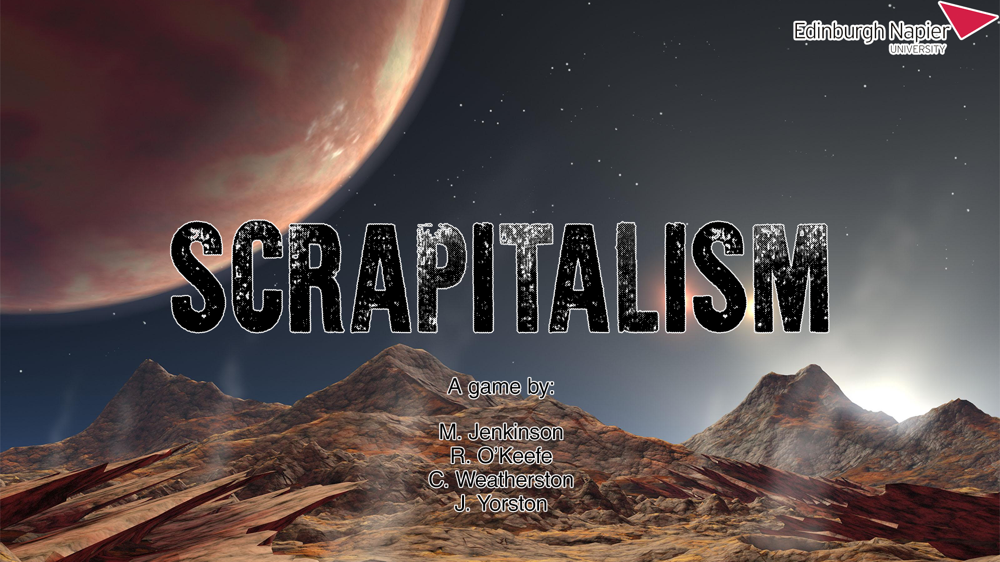

# Team-Rocket

Scrapitalism is the game project that was developed during the Advanced Games Engineering module at Edinburgh Napier University. 

The game is a real-time strategy game, in which you are to destroy the opponents base. To achieve this, you must spawn workers units to gather resources which are placed on the game map to build up combat structures and combat units. However, the enemy is also doing the same. Play fast and smart before you are defeated! 
Some of the main features in this game are:

* Building placement.
* Resource ecomonics. 
* Army management. 
* Real-time strategy. 
* Variety of combat units. 

Here is a small demo of the .

Download for the exe are provided down below:

If you are interested in the status of the most recent builds. You can check the progress of the main branches here!
Most recent: 

Development: 

Shadow-of-Intent: 

Spirit-of-Fire: 

